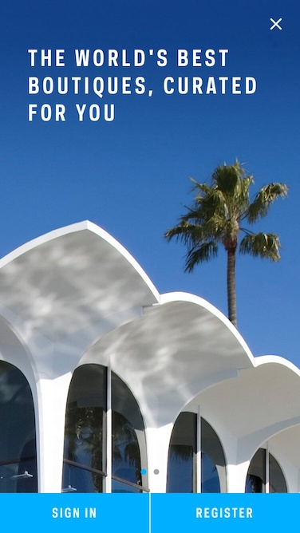

# Farfetch

This project consist in a hands-on practice for [Xamarin Forms](https://www.xamarin.com/forms) usin a public mobile app design
from [Pttrns](http://pttrns.com).

We are using the [Farftech design](http://pttrns.com/applications/572) which is a mobile application to shop online from boutiques
around the world.

# Visual Comparison

### Launch Screen
Desired UI                 |  Actual UI
:-------------------------:|:-------------------------:
  |  

### Initial Screen
Desired UI                 |  Actual UI
:-------------------------:|:-------------------------:
  |  

### Home tab page
Desired UI                 |  Actual UI
:-------------------------:|:-------------------------:
  |  

### Shop tab page
Desired UI                 |  Actual UI
:-------------------------:|:-------------------------:
  |  

### Shop detail page
Desired UI                 |  Actual UI
:-------------------------:|:-------------------------:
  |  

### Boutiques tab page
Desired UI                 |  Actual UI
:-------------------------:|:-------------------------:
  |  

### Boutiques detail page
Desired UI                 |  Actual UI
:-------------------------:|:-------------------------:
  |  

# Demo

